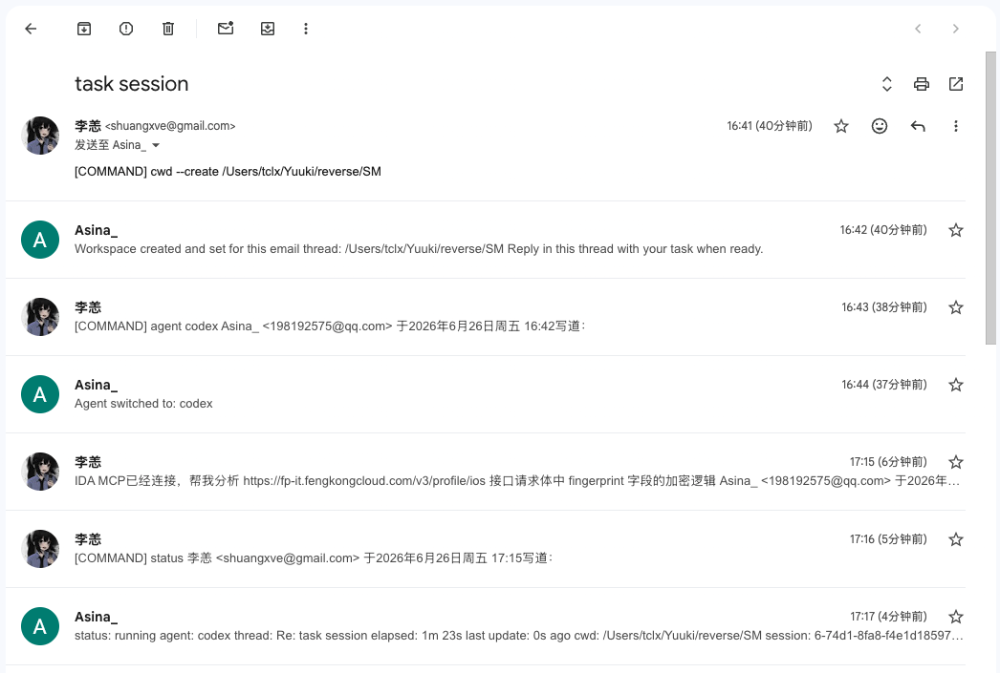
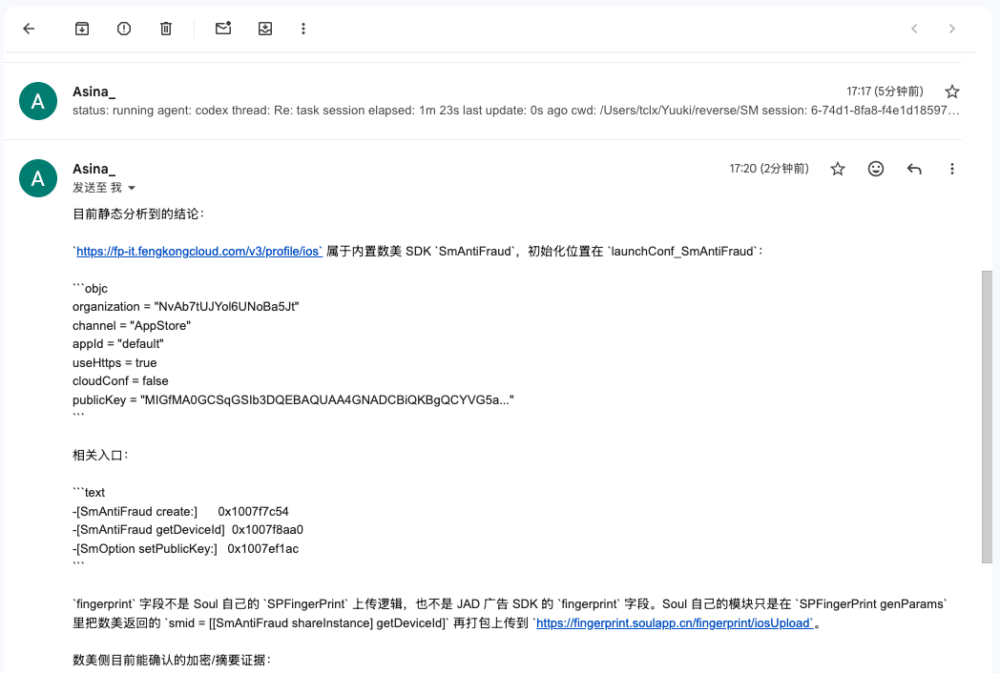

# MailPilot

项目用于把一个邮箱变成本地 CLI Agent 的远程入口。程序会轮询 IMAP 收件箱，读取白名单发件人的邮件，把邮件正文交给当前启用的 Agent 处理，然后通过 SMTP 在同一个邮件会话里回复。

当前支持：

- `opencode`
- `codex`

## QA

**为什么不直接用 OpenClaw？**

不同 Agent 的能力、上下文表现、工具调用习惯和工程体验都有差异。这个项目的目标不是再做一个统一 Agent，而是把你已经想用的本地 CLI Agent，例如 `opencode` 和 `codex`，接到一个远程邮件入口上。

**为什么不用 QQ、微信、Telegram 等聊天工具？**

邮箱天然有“会话”概念，邮件主题和回复链可以很自然地映射到 Agent session：一个邮件会话对应一组 opencode/codex 会话，切换和追踪都更清楚。邮箱 UI 也适合写长任务、贴日志、保留上下文和搜索历史；相比即时聊天，它更像一个轻量的异步任务面板。

## 展示

| 邮件任务 | 运行状态 |
| --- | --- |
|  |  |

## 需要准备什么

- Node.js 18 或更新版本
- 一个已开启 IMAP/SMTP 的邮箱
- 邮箱的授权码或应用专用密码
- 至少安装并登录一个支持的 Agent：`opencode` 或 `codex`

如果使用 QQ 邮箱，需要在 QQ 邮箱设置里开启 POP3/IMAP/SMTP 服务，并生成授权码。`.env` 里的 `IMAP_PASS` 和 `SMTP_PASS` 使用这个授权码，不要填写 QQ 登录密码。

## 安装

克隆项目并进入目录：

```bash
git clone https://github.com/SoyBeanMilkx/MailPilot.git
cd MailPilot
```

安装 Node.js 依赖：

```bash
npm install
```

复制配置模板：

```bash
cp bridge.cfg.example bridge.cfg
```

创建 `.env`：

```bash
IMAP_USER=your-address@qq.com
IMAP_PASS=your-mail-authorization-code
SMTP_USER=your-address@qq.com
SMTP_PASS=your-mail-authorization-code
```

然后编辑 `bridge.cfg`：

- `activeAgent`：默认使用的 Agent，取值为 `opencode` 或 `codex`
- `senderName`：自动回复邮件里显示的发件人名字
- `workspaceDir`：默认工作目录
- `whitelist`：允许控制 bridge 的发件人邮箱
- `agentTimeoutMs`：Agent 单次任务最长等待时间
- `agents.opencode.path`：`opencode` 可执行文件路径
- `agents.codex.path`：`codex` 可执行文件路径

## 配置字段说明

`bridge.cfg` 是本地运行配置，通常包含个人邮箱、白名单和本机路径。

| 字段 | 是否必填 | 说明 |
| --- | --- | --- |
| `activeAgent` | 是 | 普通邮件默认交给哪个 Agent 处理。支持 `opencode` 和 `codex`。也可以通过邮件命令 `[COMMAND] agent ...` 动态切换。 |
| `senderName` | 否 | 回复邮件里的显示名，例如 `Asina_`。真正的发件邮箱仍然来自 `.env` 里的 `SMTP_USER`。 |
| `workspaceDir` | 否 | 默认工作目录。没有设置线程级 cwd 时，Agent 会在这里运行。未配置时默认使用 bridge 项目目录。 |
| `agents.opencode.path` | 使用 opencode 时必填 | `opencode` 可执行文件的绝对路径。Apple Silicon Homebrew 常见路径是 `/opt/homebrew/bin/opencode`。 |
| `agents.codex.path` | 使用 Codex 时必填 | `codex` 可执行文件的绝对路径，常见路径是 `/usr/local/bin/codex`。 |
| `agents.codex.execArgs` | 否 | 创建新 Codex 会话时附加的参数。模板里允许在任意目录运行，并跳过审批/沙箱提示，适合无人值守邮件自动化。需要更严格权限时可以调整。 |
| `agents.codex.resumeArgs` | 否 | 继续 Codex 会话时附加的参数。一般与 `execArgs` 保持一致。 |
| `whitelist` | 是 | 只有这里列出的发件人可以控制 bridge。不在白名单里的发件人会收到未授权自动回复，除非它在跳过列表里。 |
| `systemPrompt` | 是 | 每次调用 Agent 前都会追加的系统提示，用来约束回复风格，例如保持简洁、像正常邮件回复一样说话。 |
| `skipSenders` | 否 | 静默跳过的发件人列表。适合放 `mailer-daemon`、`postmaster`、`no-reply` 等系统地址，避免退信或通知邮件触发循环回复。被跳过的发件人不会收到未授权自动回复。 |
| `skipSubjectKeywords` | 否 | 静默跳过的主题关键词，例如 `退信`、`bounce`、`undeliver`。匹配不区分大小写。 |
| `commandPrefix` | 是 | 邮件命令前缀，默认是 `[COMMAND]`。 |
| `maxReplyLength` | 否 | 自动回复最大长度，超过会截断。默认 `4000`。 |
| `agentTimeoutMs` | 否 | Agent 单次任务最长等待时间，单位毫秒。默认 `1800000`，也就是 30 分钟。任务超过该时间还没有最终回复时，bridge 会终止本次调用并回复超时错误。 |
| `agentCreateTimeoutMs` | 否 | 创建 Agent 会话的最长等待时间，单位毫秒。默认 `120000`，也就是 2 分钟。 |
| `imap.host` | 是 | IMAP 服务器地址。QQ 邮箱是 `imap.qq.com`。 |
| `imap.port` | 是 | IMAP 端口。QQ 邮箱 TLS 端口通常是 `993`。 |
| `imap.tls` | 是 | 是否使用 IMAP TLS，通常为 `true`。 |
| `smtp.host` | 是 | SMTP 服务器地址。QQ 邮箱是 `smtp.qq.com`。 |
| `smtp.port` | 是 | SMTP 端口。QQ 邮箱 SSL 端口通常是 `465`。 |
| `smtp.secure` | 是 | SMTP 是否一开始就使用 SSL/TLS。端口 `465` 通常为 `true`。 |

`.env` 保存邮箱凭据。

| 变量 | 说明 |
| --- | --- |
| `IMAP_USER` | 用来读取收件箱的邮箱地址。 |
| `IMAP_PASS` | IMAP 密码或邮箱授权码。 |
| `SMTP_USER` | 用来发送回复的邮箱地址，通常和 `IMAP_USER` 相同。 |
| `SMTP_PASS` | SMTP 密码或邮箱授权码，通常和 `IMAP_PASS` 相同。 |

## 运行

前台运行：

```bash
node bridge.mjs
```

macOS 下可以用 `launchctl` 后台运行：

```bash
launchctl submit \
  -l local.remote_opt.bridge \
  -o "$PWD/bridge.log" \
  -e "$PWD/bridge.log" \
  -- /usr/local/bin/node "$PWD/bridge.mjs"
```

重启后台任务：

```bash
launchctl kickstart -k gui/$(id -u)/local.remote_opt.bridge
```

查看后台状态：

```bash
launchctl print gui/$(id -u)/local.remote_opt.bridge | grep -E 'state =|pid =|last exit code'
```

查看实时日志：

```bash
tail -f bridge.log
```

## 邮件命令

命令写在邮件正文里，默认前缀是 `[COMMAND]`。

```text
[COMMAND] help
[COMMAND] config
[COMMAND] list
[COMMAND] delete <thread-key>
[COMMAND] delete-all
[COMMAND] agent
[COMMAND] agent opencode
[COMMAND] agent codex
[COMMAND] status
[COMMAND] status all
[COMMAND] cwd
[COMMAND] cwd /Users/me/project
[COMMAND] cwd --create /Users/me/new-project
[COMMAND] whitelist add user@example.com
[COMMAND] whitelist remove user@example.com
```

同一个邮件会话里，`opencode` 和 `codex` 的上下文是隔离的。切到 `codex` 时会使用 Codex 自己的会话；切回 `opencode` 时会继续 opencode 原来的会话。两边不会共享内部 session 记忆。

`[COMMAND] status` 用来查看当前邮件会话里的 Agent 工作状态，包括是否正在创建会话、是否正在运行、运行了多久、当前命令、最后一条中间回复、最后错误等。`[COMMAND] status all` 会列出所有正在运行的任务；没有任务在运行时，会显示最近记录。

`[COMMAND] cwd <absolute-path>` 用来设置当前邮件会话的工作目录。这个命令只能在新邮件会话的第一封邮件里执行；如果会话已经存在，bridge 会拒绝切换，并提示你用新主题重新发送。这样可以避免同一个邮箱会话中途换目录导致 Agent 会话混乱。

默认情况下，如果目录不存在，`cwd` 会拒绝设置。需要自动创建目录时，可以使用 `[COMMAND] cwd --create /path/to/new-project`，效果类似 `mkdir -p`。

推荐流程：用一个新主题先发送 `[COMMAND] cwd /path/to/project` 或 `[COMMAND] cwd --create /path/to/project`，收到确认后，再直接回复同一邮件会话发送任务内容。后续这个邮件会话里的 opencode/codex 都会在该目录下运行。

## 文件说明

- `bridge.mjs`：入口文件，负责启动和 IMAP 轮询
- `bridge/`：核心模块，包括 Agent 调用、命令处理、邮件解析、邮件发送、状态管理和进程锁
- `bridge.cfg`：本地运行配置
- `bridge.cfg.example`：配置模板
- `.env`：邮箱凭据
- `.opencode-bridge.json`：运行状态，记录已处理邮件 UID 和 Agent session id
- `.bridge.pid`：进程锁文件，防止重复启动多个 bridge
- `bridge.log`：运行日志

## 其他说明

- 新邮件通过 IMAP `UIDNEXT` 轮询检测，默认每 3 秒检查一次。
- 长任务期间 IMAP 连接可能被邮箱服务器断开，bridge 会在下一轮轮询时自动重连。
- 回复邮件会带上 `In-Reply-To` 和 `References` 头，方便 Gmail、QQ 邮箱等客户端把回复归到同一会话。
- 普通任务邮件被接收并排入后台 job 后会标记为已处理；Agent 超时或失败时，bridge 会在同一邮件会话里回复错误信息。
- `codex` CLI 通常通过 `env node` 启动。后台服务的 PATH 可能很短，所以 bridge 会自动把 `/usr/local/bin` 和 `/opt/homebrew/bin` 放到 PATH 前面，避免找不到 Node.js。
